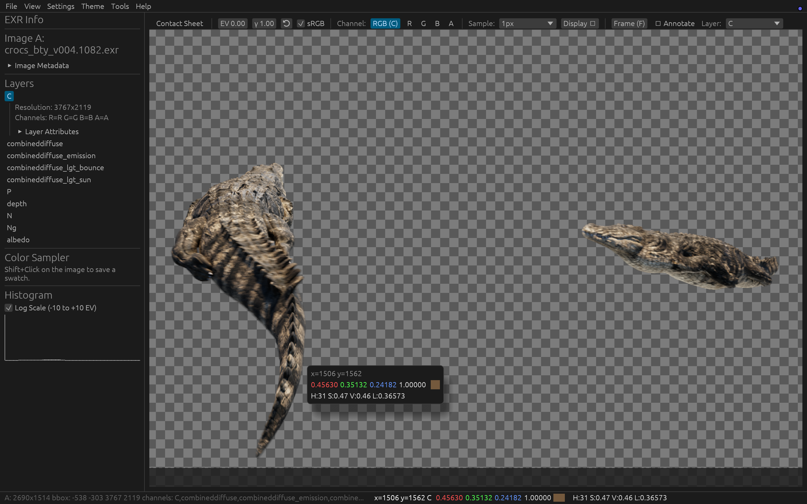
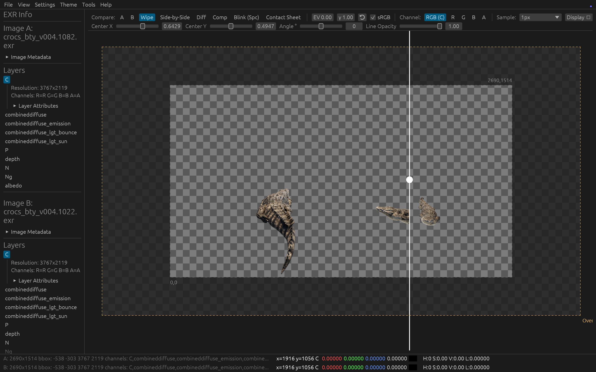
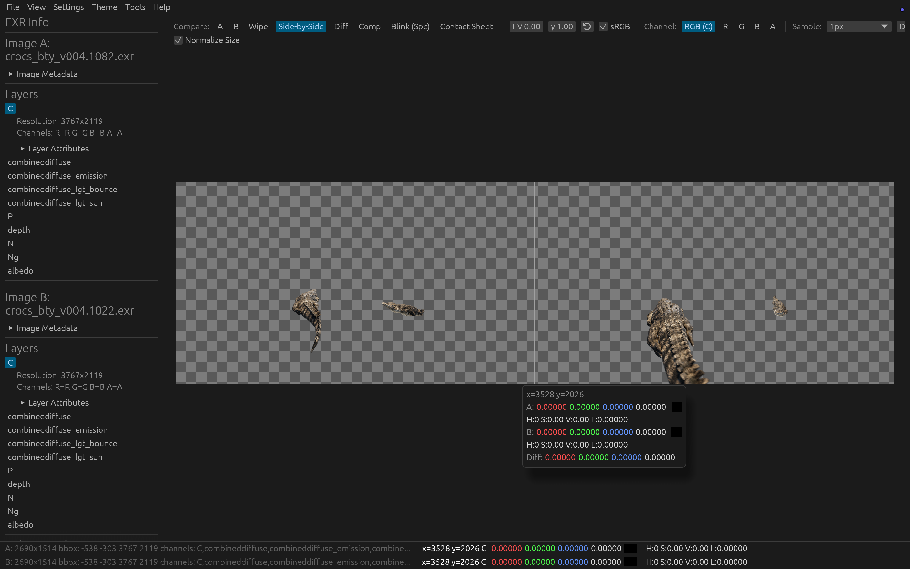

# Floki

[](https://www.rust-lang.org)
[](https://github.com/emilk/egui)
[](https://wgpu.rs)
[](https://opensource.org/licenses/MIT)

**Floki** is a fast, hardware-accelerated Rust GUI application tailored for Technical Directors, Compositors, and LookDev Artists who need to deeply inspect and compare multi-layered OpenEXR files. 

Powered by `egui`, `wgpu`, and the pure-Rust `exr` crate, it allows you to instantly view dense pixel data, isolate color channels, explore unbounded floating-point histograms, and perform pixel-perfect A/B diffing natively on your GPU.



---

## Key Features

### Hardware-Accelerated Rendering
* **Vulkan/Metal/DX12 Backend:** All image exposure scaling, gamma correction, sRGB mapping, and A/B difference matte compositing are executed via custom WGSL shaders on the GPU.
* **CPU Fallback:** Automatically drops down to multithreaded CPU rendering if a graphics card or driver is unavailable.

### Deep Inspection
* **Precision Pixel Sampling:** Hover over any pixel to reveal exact floating-point values (R, G, B, A) regardless of bit-depth (F16, F32, U32).
* **Persistent Swatches:** `Shift + Click` on the image to drop a permanent color swatch into your toolbelt for cross-referencing.
* **Metadata Explorer:** Cleanly displays embedded EXR attributes (like V-Ray/Arnold custom tags), layers, and bounding box data in collapsible panels for both Image A and Image B simultaneously.
* **Dual Contact Sheets:** Instantly view all AOVs (Arbitrary Output Variables) and layers as a scrollable grid of thumbnails. If a second image is loaded, view dual synchronized contact sheets side-by-side or seamlessly toggle between them.

### Advanced A/B Comparison
Load a Reference Image (Image B) to unlock advanced visual diffing:
* **Wipe:** Split-screen slider for boundary checks — with adjustable center, rotation angle, and divider-line opacity for wipes at any orientation.
* **Side-by-Side:** View Image A and Image B glued together in a continuous panorama. They share the same camera for synchronized panning and zooming.
* **Diff Matte:** Renders the magnitude of `A − B` as a false-colour heat map to spot fractional floating-point discrepancies in your render pipelines. Choose the colormap (black-body, grayscale, turbo, viridis, magma, inferno) or build a custom multi-stop gradient in the editor; select the magnitude metric (max channel, Rec.709 luminance, or per-channel RGB); set a noise-floor threshold to ignore sub-threshold noise; and read values off the on-screen legend.
* **Composite:** Blend A over B directly in-viewport with selectable blend modes (Over, Under, Add, Multiply, Screen).
* **Blink Mode:** Press `Spacebar` to strobe between Image A and Image B at an adjustable interval.

Comparison controls follow a two-tier toolbar: the everyday controls stay on a single row, while the active mode's parameters slide into a contextual second row only when needed.


*Wipe compare mode — drag the divider at any angle to check Image A against Image B.*


*Side-by-side — Image A and Image B share one camera for synchronized panning and zooming.*

### Image Analysis
* **Dynamic Luminance Histogram:** Real-time histogram mapped to Exposure Values (EV stops). Effortlessly spot floating-point highlights over `1.0` using the Logarithmic view.
* **Dual Histogram Mode:** When comparing two images, the histogram overlays a translucent Red graph (Image B) on top of the White graph (Image A) so you can visually align black levels.
* **Channel Isolation:** Quickly isolate `R`, `G`, `B`, `A`, or view `RGB` composite with single-key shortcuts.

### Color Management
* **3D LUT Support:** Load Adobe `.cube` 3D LUTs and apply them in real time on the GPU as a display transform, alongside the built-in Exposure/Gamma/sRGB controls (OCIO config path is also configurable).

### Customizable Viewport Background
* **Background Modes:** Replace the default transparency checkerboard with a checkerboard (custom cell colours and size), a solid colour, or a multi-stop gradient at any angle — set from **View ▸ Viewport Background**. Save named presets that persist across sessions. The background composites consistently across the GPU, CPU, and OCIO paths.

### Snapshot & Review
* **Snapshot to Clipboard:** Copy exactly what's on screen to the system clipboard with `Cmd/Ctrl + Shift + S` (or **View ▸ Snapshot to Clipboard**) — background, compare mode, OCIO, and annotations all included. Optionally also save a timestamped PNG to `~/.floki/snapshots/`.
* **Annotation Overlay:** Mark up the view with arrows, boxes, a freehand pen, and text labels (adjustable colour and stroke width) before snapshotting. Annotations anchor to image pixels so they track pan/zoom, support undo/redo and clear-all, and are flattened into the snapshot automatically.

### Batch Tooling
* **EXR Header Converter:** Bulk-rename channels across an entire directory to standard RGBA — available both as an in-app Tools window and a headless `convert_dir` CLI, parallelized across CPU cores via `rayon` with live progress and cancellation.

### High-Performance UI
* **Immediate-Mode UI:** Built on `egui` for a responsive, minimal-overhead interface.
* **Light / Dark / System Themes:** Switch the interface theme from the **Theme** menu; the `System` option tracks your OS light/dark setting live. Your choice persists across sessions.
* **Recent Files for A & B:** `File ▸ Open Recent A` / `Open Recent B` reload a recent EXR straight into the main or reference slot.
* **Drag & Drop Loading:** Drop an EXR onto the window to load it — the left half loads it as Image A, the right half as the reference Image B, with a live overlay highlighting which side will receive the drop. Drop two files at once to fill A and B together.
* **Persistent State:** Remembers your UI layout, recent files list, theme, and preferences across sessions.
* **Software Tone Mapping:** Apply Exposure, Gamma, and sRGB transforms instantly without altering the underlying raw data.
* **Resource Monitor:** A discrete status-bar readout tracks floki's own memory footprint and system RAM, plus live GPU **VRAM** usage on macOS — handy when loading heavy EXRs or sequences. It samples about once a second and tucks into the bottom-right. (The VRAM figure is macOS/Metal only for now; Windows and Linux show RAM.)

---

## Keyboard Shortcuts

| Shortcut | Action |
|----------|--------|
| `F` | Frame Image (Reset Zoom & Pan to fit screen) |
| `R` | Isolate Red Channel |
| `G` | Isolate Green Channel |
| `B` | Isolate Blue Channel |
| `A` | Isolate Alpha Channel |
| `C` | View Full RGB (Color) |
| `1` | View Image A (when B is loaded) |
| `2` | View Image B (when B is loaded) |
| `Space` | Toggle Blink Mode (Strobes between A and B) |
| `Cmd/Ctrl + Shift + S` | Snapshot the current view to the clipboard |
| `Esc` | Cancel the active annotation tool (or exit fullscreen) |
| `Shift + Click` | Sample pixel and save to swatch palette |
| `Scroll Wheel` | Zoom in/out at cursor |
| `Click + Drag` | Pan Image |
| `Drag & Drop` | Load EXR — drop on left half → Image A, right half → Image B |

---

## Installation & Building

Make sure you have [Rust and Cargo](https://rustup.rs/) installed on your system.

```bash
# Clone the repository
git clone https://github.com/byvfx/floki.git
cd floki

# Build and run the app in release mode (Highly recommended for EXR parsing speed)
cargo run --release
```

### Color management (OpenColorIO)

OCIO support is **off by default** (the standard build needs no C++ toolchain). Two opt-in builds:

**Recommended — self-contained (vendored):** statically builds OCIO 2.4.2 from the vendored
submodule, so nothing needs to be installed system-wide. Works the same on Windows, Linux,
and macOS. The first build is slow (minutes); then it's cached.

```bash
# One short command on any OS (cargo alias from .cargo/config.toml):
cargo ocio-run

# …or, to also init the submodule in one shot (requires `just`):
just ocio
```

Prerequisites: a C++ toolchain (MSVC "Desktop development with C++" on Windows; clang/gcc
elsewhere), **cmake ≥ 3.14**, **ninja**, **python3**, and the OCIO submodule checked out
(`git submodule update --init --recursive` — done automatically by `just ocio`).

**Fast dev — link an installed OCIO (system):** for when you already have OCIO installed.

```bash
# Located via OPENCOLORIO_ROOT (any OS) or Homebrew (macOS). Fast, no cmake.
cargo run --release --features ocio
```

Once running, enable it in **Color Management…** (check *Enable OCIO*). With the config-path
field empty it uses the built-in ACES config, or `$OCIO` if that environment variable is set
(e.g. `OCIO=ocio://studio-config-latest`). See [`floki-ocio/README.md`](floki-ocio/README.md)
for backend/build details.

## Debugging & Logging

The app initializes [`env_logger`](https://docs.rs/env_logger), so runtime logging is
controlled by the `RUST_LOG` environment variable. Launch the app from a terminal so
log output (written to `stderr`) is visible.

```powershell
# PowerShell — watch the EXR Header Converter work through a batch
$env:RUST_LOG = "floki=debug"
cargo run --release
```

```bash
# bash / zsh
RUST_LOG=floki=debug cargo run --release
```

Useful levels (prefix the target with `floki=` to filter out noisy `wgpu`/`eframe` logs):

| `RUST_LOG` value | What you see |
|------------------|--------------|
| `floki=info` | Conversion start line, final summary (`N of X files converted`), and any errors |
| `floki=debug` | The above plus a line per converted file and any layer left unchanged by the rename guard |
| `info` | Everything at info level, including `wgpu`/`eframe` startup |
| `floki=info,wgpu=warn` | App info logs while silencing graphics-backend chatter |

> **Note:** During batch conversion, files are processed in parallel across CPU cores, so
> per-file log lines appear interleaved/out of order. The count in the final summary is
> authoritative.

## Architecture

A birds-eye view of the workspace. The app ships as a single binary backed by a
library crate (so benches and integration tests can reach the internals), plus a
standalone `floki-ocio` crate that wraps OpenColorIO.

**App shell**
- **`main.rs`** — entry point and `eframe` / `wgpu` initialization.
- **`app.rs`** — the top-level `eframe::App`: window and menus, async EXR + LUT loading, snapshot capture, persistence, and the panel layout that hosts the viewer.
- **`resource_monitor.rs`** — throttled RAM / GPU-VRAM sampler feeding the status-bar readout.

**Image data**
- **`exr_loader.rs`** — threaded OpenEXR decode and logical-layer grouping via the `exr` crate (the load hot path the benches exercise).

**Viewer & rendering**
- **`viewer.rs`** — the heavy lifter: canvas pan/zoom, the six compare modes, pixel sampling, histograms, contact sheets, and dispatch between the GPU and CPU render paths.
- **`gpu/`** — the `wgpu` backend: `mod.rs` (pipelines, uniforms, bind groups), `shader.wgsl` (the display / compare / diff / background fragment shader), and `ocio_pass.rs` (the two-pass OCIO display transform and blit).
- **`render_math.rs`** — shared tone-mapping math (exposure / gamma / sRGB), unit-tested in one place.

**Visualization & overlays**
- **`gradient.rs`** — reusable multi-stop gradients and the diff colormaps (shared by the heat map and the gradient background).
- **`background.rs`** — the customizable viewport background (checker / solid / gradient), sampled identically across every render path.
- **`annotation.rs`** — the transient arrow / box / pen / text overlay model.
- **`snapshot.rs`** — framebuffer-screenshot capture plus the clipboard / PNG helpers.

**Color management**
- **`color/cube.rs`** — Adobe `.cube` 3D-LUT parsing.
- **`floki-ocio/`** — a standalone crate wrapping OpenColorIO over FFI, with a GLSL→WGSL shader transpiler; linked only under the `ocio` / `ocio-vendored` features.

**Tooling & CLI**
- **`tools.rs`** — the multi-threaded EXR Header Converter (batch channel renaming via `rayon`) with progress reporting and `RUST_LOG` logging.
- **`bin/`** — headless helpers: `convert_dir` (batch rename), `inspect_exr`, and `check_types`.

## License

This project is licensed under the MIT License - see the [LICENSE](LICENSE) file for details.
